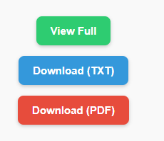

# Scribd Material Downloader (Safe PDF)

The **Scribd Material Downloader** is a lightweight userscript that removes restrictions on Scribd documents. It allows you to view the full content, download the text as a `.txt` file, or generate a PDF directly in your browser—**without using any external servers**.

---

## Features

- **View Full Document** – Opens the embedded version of the document for unrestricted access.  
- **Download as TXT** – Extracts the text into a plain text file locally in your browser.  
- **Download as PDF** – Generates a PDF file locally in your browser (no external service needed).

---

## Installation

### From GreasyFork
1. Install a userscript manager if you haven’t already:
   - **Chrome**: Tampermonkey or Violentmonkey  
   - **Firefox**: Tampermonkey, Violentmonkey, or Greasemonkey  
2. Go to the [Scribd Material Downloader script page on GreasyFork](https://greasyfork.org/en/scripts/550292-scribd-material-downloader-safe-pdf)  
3. Click **Install this script** in your userscript manager.  
4. Confirm the installation.

### From GitHub
1. Install a userscript manager if you haven’t already.  
2. Open the raw file from this repository: [scribd-material-downloader.user.js](https://raw.githubusercontent.com/Angesom12/scribd-material-downloader/main/scribd-material-downloader.user.js).  
3. Click **Install** in your userscript manager.

---

## Usage

1. After installing the script, visit any Scribd document page.  
2. You will see three new buttons added to the page:  
   - **View Full** – Opens the embedded version of the document.  
   - **Download (TXT)** – Saves the text content as a `.txt` file locally.  
   - **Download (PDF)** – Generates a PDF file locally in your browser.  

### Example Interface

---

## Notes

- Both TXT and PDF exports work **entirely in your browser**, so no external server is involved.  
- Ensure your userscript manager is enabled and active for the buttons to appear.  
- PDF generation uses the [jsPDF library](https://github.com/parallax/jsPDF), loaded from your GitHub repository.

---

## License

This project is licensed under the **MIT License**.

